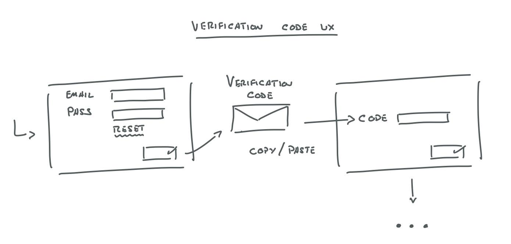

# Firefly Authentication
The Firefly authentication module is mostly custom, relying on a few inbuilt encryption features in Rails and a small library for generating one-time-passwords. This approach allows us customize our login, authentication and user-management process to our current and future requirements.

## Process
This is a high-level description of the user creation and login process.
- An authenticated user can create another user from the users UI
- The 'new user' form does not allow a password to be set, and instead sends a login token to the new user's email
- The token is good for 2 days, but the user is forced to set a password when using it
- All passwords are encrypted using an irreversible algorithm, and so not even Admins will know a users password.
- There is a `password_expires_at` datetime field on the user table. 1 year is added from the day that the password is changed. This takes place every time the password is changed.
- There is a `locked` boolean on the user table, which is compared when the user attempts to login.
- There is a `requires_verification` boolean on the users table, which is `true` by default. This requires the user to a perform 2-step login.
- The 2-step login works by first authenticating that the users email and password are correct. A time-based one-time-password is then sent to the users email. They must enter this within 5 minutes for the login to be completed.

## Authentication Mechanism
The validity of a users session is checked on every page load by the `Authentication` concern mixed into the `ApplicationController`. There are a few exceptions to this, such as not authenticating in development, and not authenticating the login URL.

## Creating a new Session
When the user submits their login details, the `create` action of the `SessionsController` is called, which looks up the user and checks their credentials using the [has_secure_password](https://api.rubyonrails.org/classes/ActiveModel/SecurePassword/ClassMethods.html) feature built into Rails. Several methods are then run to determine the next step, in this order – `notify_of_lock`, `reset_password`, `verify_user`, `complete_login`.

#### 1 - Notify of Lock
Handled by the `AccountLock` concern, this just checks if the `locked` boolean is set on the user, and redirects them to the login if `true`. A message is displayed asking the user to contact support.

#### 2 - Reset Password
Handled by the `PasswordReset` concern, this checks if the `password_expires_at` is less than the current time, and redirects to the `new_password_reset_path` if so. See the Password Reset Mechanism section for specifics on how this works.

#### 3 - Verify User
Handled by the `Verification` concern, this checks if the user `requires_verification?`, if so, a TOTP (Time-based One Time Password) is built and emailed to the user. The user must then enter this to complete the login. Since the TOTP is the same standard used to many 2-factor mechanisms, this leaves the door open to implement something like Google Authenticator.

#### 4 - Continue Login
Handled by the session controller itself, if none of the above apply, the user is simply logged in.

## Password Reset Mechanism
 - There is a password reset on the login page (`/login`). Clicking this renders the `new` action of the `PasswordResetsController`.
 - The user enters their email address, which is `POST`ed to the `create` method of the `PasswordResetsController`
 - This `create` method then verifies the email exists, creates a [Global ID](https://github.com/rails/globalid) to use as a reset token which expires in 10 mins
 - The `UserMailer` then handles the sending of the password reset email. The user mailer is akin to a controller.
 - The 'view' for the `UserMailer` `password_reset` action is located at `app/views/user_mailer/password_reset.html.erb`
 - When the user clicks on the link in the email, the `edit` action of the `PasswordResetsController` is rendered. The action looks up the user from the database using the Global ID (URL). If the GID has expired, or the 'Purpose' (`for: 'password_reset'`) is incorrect, the user is redirected back to the login path.
 - Otherwise, the user enters a new password, and the `update` action of the `PasswordResetsController` is called. This action looks up the user, updates the user attributes, logs in the user, and redirects them to the `root_url`

## User Creation
The `NewUserSetup` concern on the `User` model includes some callbacks which are triggers on user creation. These set the password to expired, and trigger the `UserMailer` to send out an email to the user, containing a login token. This login token is the same mechanism used by the password reset mechanism, and so the user is actually being asked to reset their password on first login.

## Password Policy
- must be between 10-70 Characters.
- must contain at least one Lowercase Letter.
- must contain at least one Uppercase Letter.
- must contain at least one Numeric letter
- must contain at least one Special Character.

## Phone Number,Country code Policy
- Phone number and country code are required.
- must be between 8-15 Characters.
- must only contain digits or '-'.
- Country code must be select from list.

## Email policy
Emails must be of thalesinflight.com or thalesgroup.com

## Redirect after login
By default, user will be redirected to root after login. However, in a scenario where user is not logged-in and requested a specific page rather than root, maybe by clicking on an email link then requested url will be preserved and user will be redirected to same after login.

## Reference Images of UX Flow

