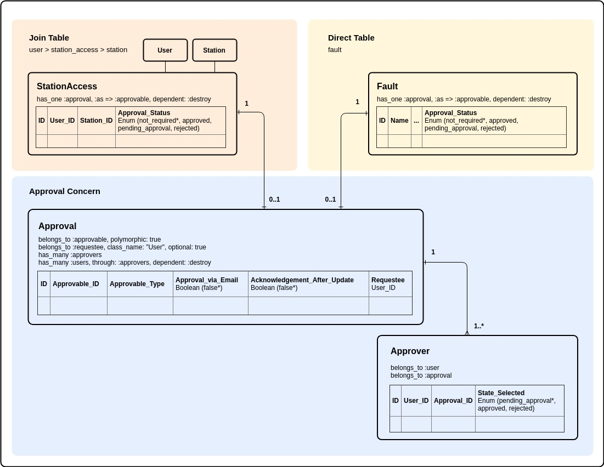

# Overview
Additional features are added to stations/users to accommodate following:

- Added "Home Station" field in user's model to reduce data-entry time and errors.
- Quick access to any other station (read-only) via station's page and quick peek menu.
- Request full access of any other station to record transactions under that station.

### Home Station
User can only work and record his transactions under a selected home station. This will reduce data-entry time and errors. Home station can be easily switched to any other station present in user's "My stations" list using the top menu.

Switching home station to any other station present in "My stations" will give user "write access" to record transactions under that station.

### My Stations
User can request full access to other stations from station's page. By default, request will be submitted to all managers of the station being requested.

Upon approval, requested station will be added to user's "my stations" list and can be easily switch to home station via user's menu.

Admin and managers request for full access will be approved instantly and no email requests will be sent out.

### Adding Users to Station
Admin/managers can add users to their home station by clicking "Add User" button from station/users page. Following page will ask user's email address to check if user is already in system or a first time user.

**In-case of new user:** A new user creation form will be rendered with email and home station pre-filled.

**In-case of existing user:** A different page will be rendered with user details and a button to add user to station.

*Currently, system only accepts "Thales" email addresses so its very important to setup user email address before adding him in.*

### Browsing Stations via Station's Index Page
User can browse other stations using station's index page. Browsing other stations won't switch home station.

### Quick Peek via Breadcrumb
User can temporarily peek into any "My Stations" station using breadcrumb hidden menu. Peeking into other station won't switch home station.

# Technical Details
Some details here might overlap with "approval" process but it will be helpful in understanding the whole process.

### Requesting Full Access of Other Station
User can request access to any other station via two different ways:

#### 1. Stations Page (via email approval)
By default, any request of station access will set "approval_status" field to "not_required". If the logged-in user is a manager or admin, process will end here and station will be added to his "my stations" list.

If logged in user is not an admin or manager, then "approval_status" will be set to "pending_approval" and the following models will get updated:

**Approval (Polymorphic Association)**
approvable_id: will reference the station_access id
approvable_type: will reference the station_access column
approval_via_email: true
acknowledgment_after_update: true
requestee: will reference the logged-in user
approvers (has_many association): all managers of requested station will be added to this model

After the above entries, user will be redirected to station's page and will be shown "Pending Approval" next to the station requested. On the other hand, web-server will automatically send out emails to all the approvers following the options defined in "approval_email_options.rb".

Upon approval by manager(s), user will get an acknowledgment email and his stations page will update to reflect the same.

If approval was not granted within the expiry date, request will be deleted and user can re-request the access following the same procedure.

#### 2. Station/users Page (requestee present at the station)**
User can also request full access of station via in-person. However, only station managers can grant this permission from their station/users page.

This approach will grant permission instantly and no requesting emails will be sent out.

**Approval (Polymorphic Association)**
approvable_id: will reference the station_access id
approvable_type: will reference the station_access column
approval_via_email: false
acknowledgment_after_update: false
requestee: user requesting permission
approvers (has_many association): manager, currently logged-in

### Helpful Methods and Terms
- user.stations: all user stations
- user.stations: user stations with approval_status [:not_required, :approved].
- user.approved_stations: user stations with approval_status :approved.
- user.pending_stations: user stations with approval_status :pending.
- enum approval_status: { not_required: "not_required", pending: "pending", approved: "approved", rejected: "rejected" }

### Database Migrations
- Added "home_station" (station) field to "User" model.
- Added "approval_status" (enum) field to "StationAccess" model.
- Linked "StationAccess" model to "Approval" model.

#### ERD:

