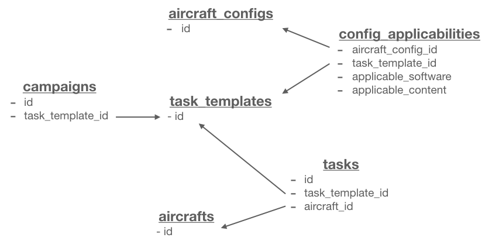

# Task Scheduling
## Overview
Task Scheduling capability is primarily for Station Controllers and the MOC (Maintenance Operation Center). The main entry page, `/airlines/:id/tasks`, is designed to provide the controller an overview of their fleet – which tasks are planned and due, both in the short and long term. It is displayed as a grid, with aircraft tails on the Y axis and task templates along the X axis.

There are two types of tasks; 'recurring tasks' which live on a schedule and re-spawn themselves on completion, and 'campaign tasks' which are a group of tasks executed over a fixed period of time, such as content loads or mod upgrades.

Both types of task are controlled by a Task Template. The Template dictates the applicable aircraft configurations and schedule.

Tasks can update properties of the aircraft, such as current software or content, making it easy to keep track of fleet configuration.

Technical documents can also be attached to the task via the template.

### Data Model

    1. TaskTemplate has_many :fleets, through: :config_applicabilities

    2. Campaign belongs_to :task_template

    3. TaskTemplate has_many :tasks

    4. Task belongs_to :aircraft

## Task Templates
The Task Template is the parent of the tasks. It contains information about which aircraft configurations are applicable, and which software and content should be applied by the task to the aircraft. The user will set up task templates, which will in-turn spawn all the applicable tasks. This logic is defined in the `Schedulable` concern of the `TaskTemplate` model.

A user cannot create an individual task outside of the task template UI.

### Task Template UI Flow

## Tasks
A task belongs to a task template, and is essentially a copy of its task template. The task also belongs to an aircraft, and once it is `completed` (`state` on the `Task` model) by the user, it will automatically respawn if its a recurring task. If the task is a campaign task, it will not respawn. This logic is defined in the `Respawnable` concern of the `Task` model, which gets invoked by a callback after the task is updated.

## Config Applicabilities
The `ConfigApplicability`, as well as joining the `task_templates` to the `fleets`, also stores the `applicable_software` and `applicable_content` which can been set by the user on the `new` Task Template page (`/airlines/:id/task_templates/new`).

## Campaign
A Task Template has a `mode` of either `campaign` or `recurring`. A campaign task template also has an associated model – `Campaign`. This is to store additional information specific to campaigns.
